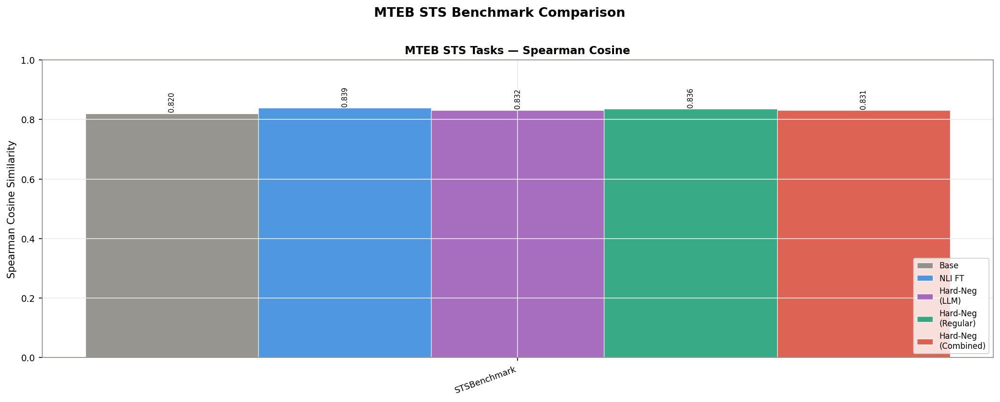
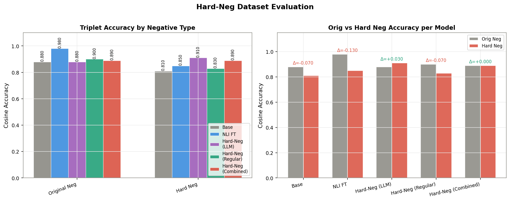
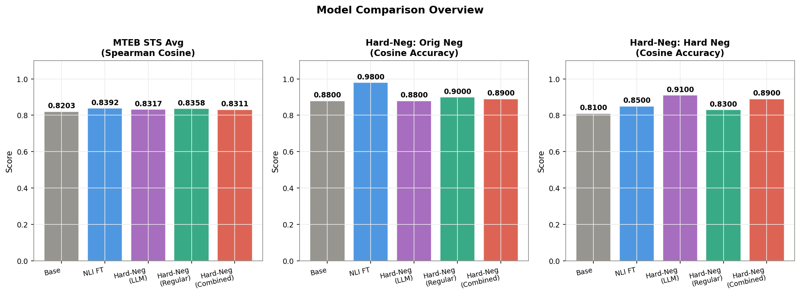

# Model Evaluation Report

**Date**: 20260420_142631

## Models

| Key | Path |
|-----|------|
| `base` | `all-MiniLM-L6-v2` |
| `nli` | `/hpc2hdd/home/ffu000/representation_learning/hard_neg/models/{}_mpnet-base-nli-for-simcse-triplet/final` |
| `llm` | `/hpc2hdd/home/ffu000/representation_learning/hard_neg/models/20260418_052143_compare/llm/final` |
| `regular` | `/hpc2hdd/home/ffu000/representation_learning/hard_neg/models/20260418_052143_compare/regular/final` |
| `combined` | `/hpc2hdd/home/ffu000/representation_learning/hard_neg/models/20260418_052143_compare/combined/final` |

## Part 1: MTEB STS Benchmark

Metric: **Spearman Cosine Similarity**

| Task | Base | NLI FT | Hard-Neg (LLM) | Hard-Neg (Regular) | Hard-Neg (Combined) |
|------|------|------|------|------|------|
| STSBenchmark | 0.8203 | 0.8392 | 0.8317 | 0.8358 | 0.8311 |
| **Average** | **0.8203** | **0.8392** | **0.8317** | **0.8358** | **0.8311** |

## Part 2: Hard-Neg Dataset Evaluation

Metric: **Cosine Accuracy** (TripletEvaluator, n=100)

| Metric | Base | NLI FT | Hard-Neg (LLM) | Hard-Neg (Regular) | Hard-Neg (Combined) |
|--------|------|------|------|------|------|
| Original Neg Accuracy | 0.8800 | 0.9800 | 0.8800 | 0.9000 | 0.8900 |
| Hard Neg Accuracy | 0.8100 | 0.8500 | 0.9100 | 0.8300 | 0.8900 |

## Overview

